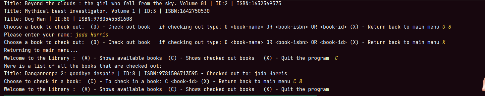

The one interesting piece of code that I have is actually near the end where it returns to choose a book to check out. Funny enough, I stuck becauses I  was mixing up me checking out a book with checking in a book. So, when I was running the complier i was pressing c for check in instead of check out. My check in should've been O. 
